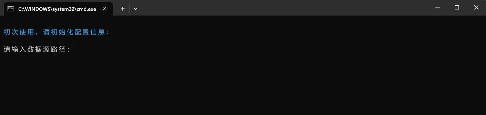
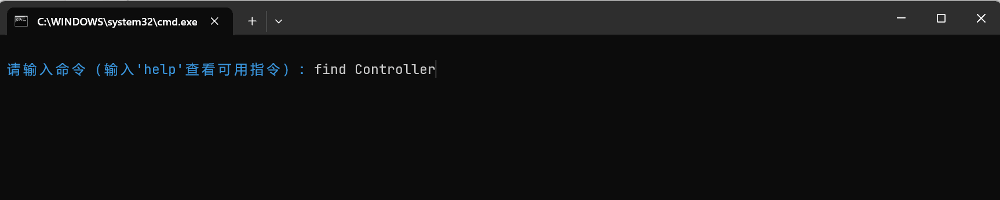
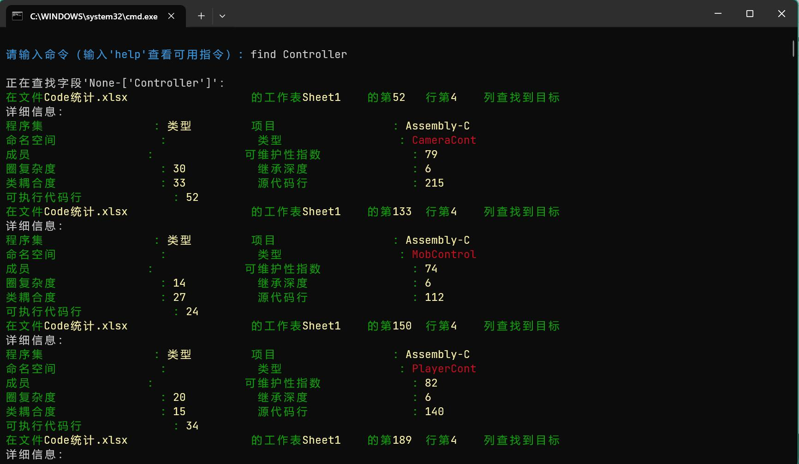
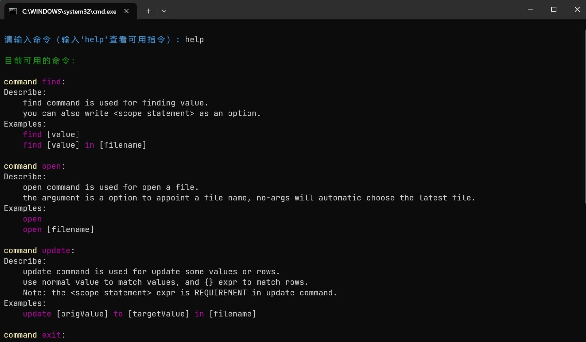

# Xlsx-Data-Console 中文文档
To view English document, please access on: https://translate.google.com/

XlDb是简易的数据库服务程序, 它支持以xlsx表格文件为数据源, 并构造简易数据库服务. 您可以方便的使用该程序查找多个xlsx表格文件中的特定关键字, 或是实现批量条件修改等功能.

该程序尚处于开发状态, 后续将有更多有趣的功能与大家见面. 有时我不能及时保持文档的内容为最新, 请在遇到意外情况时联系我或提交issue.

## 环境配置

要使用XlDb, 你的PC需要拥有python3.8及以上的运行环境, 并配置相应的环境变量.  
python下载链接: https://www.python.org/downloads/

若不清楚是否具备环境, 可按以下方式查询:  
> 使用win+R键呼出"运行", 在对话框中输入```cmd```, 按Enter键进入命令行.  
> 在命令行中输入```python```并按Enter键. 若出现python的版本号信息, 则说明环境已配置正确.


## 开始

打开程序的安装目录, 双击```startup.bat```即可进入程序.

如果此时提示"模块XXX"不存在, 表示缺少该python库. 在Windows-cmd命令行中输入

    pip install 模块名

即可安装对应的包.

初次运行时, 你会看到如下配置信息窗口:



完成配置信息的录入即可进入程序. 此后若需要修改配置信息, 可访问```安装目录/.resx/config.xml```.

配置文件中字段的释义如下:  
> ```datasource```: 数据源路径, 程序会以给定目录下的所有```.xlsx```文件作为数据源进行操作.  
> ```windowtitle```: 打开.xlsx文件时的窗口尾缀. 打开任意一个xlsx文件, 文件名后面的部分即为尾缀. 需要包含空格. 
>> 在windows系统上使用excel时, 尾缀通常是``` - Excel```  


## 使用命令

恭喜! 当你看到如下图所示的界面时, 程序已经处于运行状态了.


下面, 从最简单的查询命令```find```开始, 我们来演示如何通过输入命令来实现数据操作.  

要使用```find```命令, 请在命令行中按如下格式输入:  
> ```find FieldName```

其中```FieldName```是你希望查找的字段的名称. 下图是一个示例:



此时按下Enter键, 程序将会查找所有```数据源路径```下中所有```.xlsx```文件中与该字段相匹配的单元格, 并按如下格式向你汇报:



> 注意: 目前程序仅可以自动对齐英文字符. 如果你表格的单元格中含有中文字符, 则输出信息可能会出现如上图所示的不对齐情况.

### 高级语法

以上展示了```find```命令最基本的使用方式. 实际上, XlDb支持诸如批处理, 表达式等更高级的用法. 下面是一些示例:

- 范围语句块:  

    在指定表格文件中查找:
    > ```find FieldName in XXX.xlsx```  

    在除了指定表格外的所有文件中查找:
    > ```find FieldName except XXX.xlsx```

- 连续查找表达式:

    依次查找[1001, 1002]两个字段: (支持以空格分隔的任意数量字段)
    > ```find 1001 1002```  

    依次查找[1001, 1002, 1003 1004 1005]这五个字段:
    > ```find 1001-1005```  

    [与范围语句连用] 在XXX.xlsx中查找1001...1005这五个字段:
    > ```find 1001-1005 in XXX.xlsx```  

- 条件匹配表达式:

    查找所有"命名空间"列为"UnityEngine"的单元格:
    > ```find {命名空间=UnityEngine}```

    [与连续查找表达式连用] 查找所有年龄为0-18岁的单元格
    > ```find {年龄=0-18}```

## 更多

您也可以输入```help```命令来查看更多命令的使用方法和帮助信息. 有时我可能无法及时在文档中更新最新内容, 此时程序内置的帮助功能将会是您最好的依靠.


